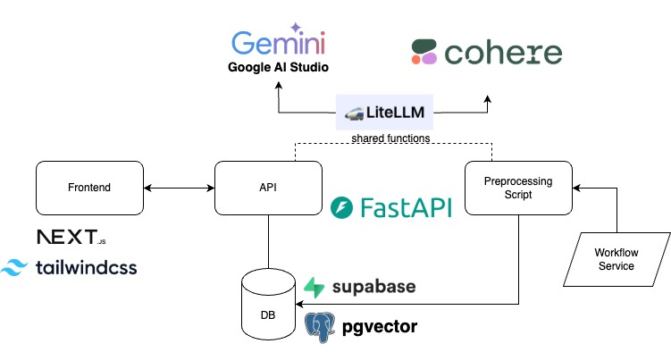
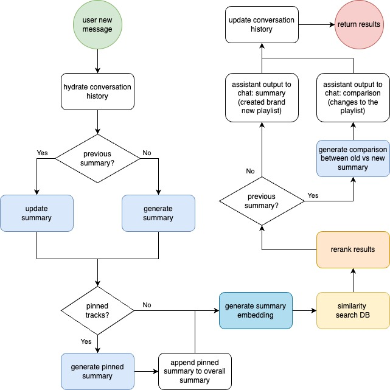

# Playlist Creator

Table of Contents:

- [Overview](#overview)
- [Architecture](#architecture)
- [Notable Dependencies](#notable-dependencies)
- [Running Locally](#running-locally)
- [Demo Video](#demo-video)
- [Further Reading](#further-reading)
  - [Extensions](#extensions)

## Overview

This app helps you create and tailor a new music playlist to your preferences. Chat with the bot to determine your requirements, pin the tracks you like, and continue prompting to get more results.

Please do not spam the submit button needlessly. This demo uses a trial API key with maximum usage limits, which should be sufficient for normal use.

This demo only has 43 songs available, due to time constraints in preprocessing. As such, generated playlists are limited to length = 5.

There is no localization or auth, so you will see conversations from other users (me testing stuff).

This project uses a private database / dataset. It is essentially a bunch of preprocessed songs, with a generated text description and embedding.

Notably, it feels like you're interacting with a chatbot, but a system of agents works behind the scenes to replicate this experience. The goal was to maximize retrieval quality via RAG (the irony), and the chatbot experience is the guidance mechanism for a sort of feedback cycle.

## Architecture

Systems Architecture:



Chat Flow:

- User does not interact directly with a chatbot
- A system of helper prompts (very simple, highly-focused agents) simulate a chat experience
- Most users just want a playlist of songs... retrieval is the most critical component
- The "chatbot" experience is its guidance mechanism: use RAG to capture preferences better, feed back into retrieval - chatting more -> loops the process!



## Notable Dependencies

Pre-processing music:

- `gemini-2.0-flash-exp` provided through Google Gen AI Python SDK
  - was used/required for exceptionally strong understanding of audio input formats given its price (completely free)
- temporal.io for concurrent processing

User-facing experience:

- LiteLLM Python SDK
- `gemini-2.0-flash-exp` for text<->text tasks
- Cohere's `embed-multilingual-v3.0` for embeddings
  - English model probably suffices, but I wanted to avoid mishandling any songs that used other languages (ex. song titles)
  - provides separate embedding generation for stored documents vs. queries
- Cohere's `rerank-english-v3.0`

Database: Supabase + pgvector

Backend: FastAPI

## Running Locally

Create your own `.env` files following the `.example.env` files present in **BOTH** `/frontend` and `/backend`.

- Almost all resources are completely free of charge
- A free trial API key can be obtained from Cohere, with various limits imposed

Backend:

```bash
cd backend
pip install -r requirements.txt
fastapi run main.py
# replace 'run' with 'dev' for development
```

Frontend:

```bash
cd frontend
npm i
npm run build
npm start
# replace the previous two lines with 'npm run dev' for development
```

Data:
You must create the following tables in Supabase:


Relationships:
- Messages
  - convo_id -> FK -> Conversations.id
- Suggested, Pinned, Discarded
  - convo_id -> FK -> Conversations.id
  - track_id -> FK -> Tracks.id

The only data you need to pre-populate is the Tracks. There should also be an outdated pre-processing script in the codebase somewhere. 

## Demo Video
[Youtube Video](https://youtu.be/TyVHrBgZdLo)

## Further Reading

If this project interests you, here's some more details I wanted to point out.

### Extensions

- auth, accounts, local sessions
- summarizing results: have the agent system summarize directly on the tracks it produced, as a double-check
- LLM call tracing
- publication dates for songs
- injecting a couple unrelated songs: creates more robust experience / prevent "overfit"

### Did not get to do:

- discarding tracks: avoid fetching tracks that the user has explicitly discarded
  - generating summary on discarded tracks
- Spotify integration:
  - play song snippets
  - link account
  - directly create playlist for user
